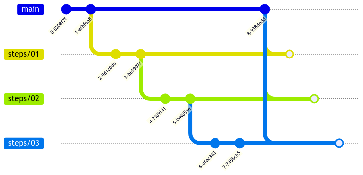

# SOLID coaching

The aim of this repository is to provide a coaching material about SOLID.

Though this examples should be used from «students» itself, they are tailor-made to an agile technical coaching approach.

## About this repo

The repo is made using C# language on dotnet 6+.

The `main` branch intentionally contains a **dirty code**, that is not respecting any of the SOLID principles.

The `steps/*` branches contains the refactored code, each step has the explanation and an example of a SOLID principle.

Steps are subsequent: step 2 starts from step 1 and so on.

### Example

* `steps/01_SRP` contains the code refactored to fulfill the Single Responsibility Principle
* `steps/02_OCP` contains the `steps/01` code, but with the Open-Closed Principle implemented
* ...
* last step contains the fully refactored code, respecting all SOLID principles

### Remarks

As the `steps` are sequential, an edit to the previous branch should be merged to the next step:

## Further reading

There's a resource that excellently give a lot of readings that can be used to learn and understand SOLID principles: [Wikipedia](https://en.wikipedia.org/wiki/SOLID).

Some other strong recommended readings:

* Robert C. Martin sheets:
  * [Design Principles and Design Patterns](https://web.archive.org/web/20150906155800/http://www.objectmentor.com/resources/articles/Principles_and_Patterns.pdf)
  * [Single Responsibility Principle](https://web.archive.org/web/20150202200348/http://www.objectmentor.com/resources/articles/srp.pdf)
  * [Open/Closed Principle](https://web.archive.org/web/20150905081105/http://www.objectmentor.com/resources/articles/ocp.pdf)
  * [Liskov Substitution Principle](https://web.archive.org/web/20150905081111/http://www.objectmentor.com/resources/articles/lsp.pdf)
  * [Interface Segregation Principle](https://web.archive.org/web/20150905081110/http://www.objectmentor.com/resources/articles/isp.pdf)
  * [Dependency Inversion Principle](https://web.archive.org/web/20150905081103/http://www.objectmentor.com/resources/articles/dip.pdf)
* Robert C. Martin books:
  * Agile Software Development, Principles, Patterns, and Practices (ISBN 978-0135974445)
  * Clean Code: A Handbook of Agile Software Craftsmanship (ISBN 978-0132350884)
  * Clean Architecture: A Craftsman's Guide to Software Structure and Design (ISBN 9780134494166)
