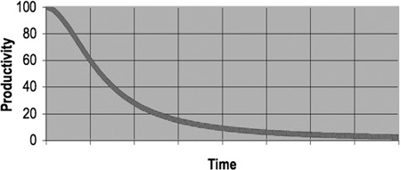

# Single Responsibility Principle

The Single Responsibility Principle (SRP) states that a class or module should have *one, and only one, reason to change*.

Where *responsibility* is defined as *reason to change*.

## In practice

Let's consider the `WallBuilder` class and ask ourself

> When the class need to be changed? What should the class change?

Answer is «when the wall changes». Is it true?

Of course, it is: if the wall height or shape changes, the class will have to change. (`BuildWall` method)

But wait! Also when the single row width or shape changes, the class needs to change! (`NewBricksRow` and `PlaceBrickInRow` method)

**!! We are breaking the SRP rule !!**

## Why is this a problem?

During the creation of a class, breaking the SRP is not a problem itself.

The problems begun when you've to modify the class: when the SRP is not fulfilled a change to a responsibility (e.g. the shape of a row), could unexpectedly have a side effect on some other responsibility (e.g. the height of the wall), causing a not-easy detectable regression.

When the number of the changes increase, the probability to introduce some other bugs increase as well.

This will generate a chain of bug that will result in a «mess», in which the productivity will constantly decrease asymptotically to zero.

For further details see the chapter [The Total Cost of Owning a Mess](https://www.informit.com/articles/article.aspx?p=1235624&seqNum=3) from «Clean Code: A Handbook of Agile Software Craftsmanship book».

## How could we fix this?

Let's refactor the code!

> Tip: code should always provide automatic tests that could be executed to verify that the refactor didn't break the initial functionality. 
> When tests are not provided you could:
>
> * start using the IDE refactor functionalities (for example in Visual Studio Code)
> * proceed using a «Refactor by TDD» approach. This method will be explained in [bdd-training](https://github.com/solid-bases/bdd-training) repository.
