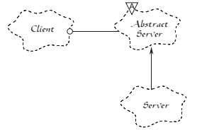

# Open-Closed Principle

The open–closed principle (OCP) states

> «software entities (classes, modules, functions, etc.) should be open for extension, but closed for modification»

This means that developers should design modules that *never changes*: if requirements change and new functionalities needs to be added, the behaviour of the module will be extended adding new code, not by changing old code that already works.

> Note: this does not applies to bug resolution.

In order to achieve this result, use of `inheritance`, `abstract` classes and/or `interface` is fundamental.

## Abstract classes and virtual members

Classes could be *concrete* or *abstract*.

A class is *concrete* if it is defined without the `abstract` keyword and, as a result, it could be instantiated:

```csharp
class ThisIsConcrete {}

// [in the meantime, far far away]
var concrete = new ThisIsConcrete();
```

A class is *abstract* if the `abstract` keyword is given and, as a result, it could not be instantiated and could only be used as base class:

```csharp
abstract class ThisIsAbstract {}

class ThisIsConcrete : ThisIsAbstract {}

// [in the meantime, far far away]
var concrete = new ThisIsConcrete();
```

### Virtual members

A class member could be `virtual`.

When a member is `virtual`, its implementation can be overridden in a derived class:

```csharp
abstract class ThisIsAbstract {
    public virtual void ThisIsVirtual() {
        // implementation 1
    }
}

class ThisIsConcrete : ThisIsAbstract {
    public override void ThisIsVirtual() {
        // implementation 2
        base.ThisIsVirtual() // this will execute also «implementation 1» code
    }
}

// [in the meantime, far far away]
var concrete = new ThisIsConcrete();
```

If a member is not virtual, this cannot be done.

> Note: in C# there's the awful `new` keyword that allows not virtual methods to be *replaced* (please not: it's a *replacement*, not an overriding). **Please don't use it, or the wrath of the gods will come upon us all** (😁).

## OCP example

Let's consider

* the interface

  ```csharp
  interface IAnimal {
      void makeSound();
      void defendCubs();
  }
  ```

* its «extension»

  ```csharp
  interface IBird {
      void makeSound();
      void defendCubs();
      void canFly();
      void hasBeak();
  }
  ```

* and the «consumer»

  ```csharp
  class Zoo {
    List<Animal> cage;
    public void putAnimalInTheCage(Animal animal) {
        cage.Add(animal);
    }
  }
  ```

This code does not fulfill the Open-Closed principle as, to add birds in the cage, we need to change the `putAnimalInTheCage` code.

Let's solve this with two different approaches:

* implementation inheritance
* interface inheritance

### Implementation inheritance

When the implementation in inherited, the initial class `Animal` will be

```csharp
abstract class GenericAnimal {
    public virtual void makeSound() { /* implementation 1 */ }
    public virtual void defendCubs() { /* implementation 1 */ }
}
```

Then the `Bird` class, that may or may not have the same interface of `Animal`, will extend the `GenericAnimal` one:

```csharp
class Animal : GenericAnimal {}
class Bird : GenericAnimal, IBird {
    public override void defendCubs() { /* implementation 2! */ }
    public void canFly() { /* implementation */ }
    public void hasBeak() { /* implementation */ }
}
```

Now:

* as the `makeSound()` and `defendCubs()` methods will be inherited from the base class, we will not need to define it (but we can always override them!).
* as both `Bird` and `Animal` are derived from `GenericAnimal`, either if they have or not have the same interface, we can use `GenericAnimal` base class for both.

In this way `Zoo` code will be

```csharp
class Zoo {
  List<GenericAnimal> cage;
  public void putAnimalInTheCage(GenericAnimal animal) {
      cage.Add(animal);
  }
}
```

and we can put generic animals, birds or any other specific future defined animal in the cage, without changing the `Zoo` code.

### Interface inheritance

In this case the open-closed principle is done using the interface inheritance:

```csharp
interface IAnimal {
    void makeSound();
    void defendCubs();
}

interface IBird : IAnimal {
    void canFly();
    void hasBeak();
}
```

and the classes may or may not have the same base class:

* solution 1

  ```csharp
  class Animal : IAnimal {
      void makeSound() { /* implementation 1 */ }
      void defendCubs() { /* implementation 1 */ }
  }
  class Bird : IBird {
      void makeSound() { /* implementation 2 */ }
      void defendCubs() { /* implementation 2 */ }
      void canFly() { /* implementation */ }
      void hasBeak() { /* implementation */ }
  }
  class Zoo {
    List<IAnimal> cage;
    public void putAnimalInTheCage(IAnimal animal) {
        cage.Add(animal);
    }
  }
  ```

* solution 2

  ```csharp
  class Animal : IAnimal {
      void makeSound() { /* implementation */ }
      void defendCubs() { /* implementation */ }
  }
  class Bird : Animal, IBird {
      void canFly() { /* implementation */ }
      void hasBeak() { /* implementation */ }
  }
  class Zoo {
    List<IAnimal> cage;
    public void putAnimalInTheCage(IAnimal animal) {
        cage.Add(animal);
    }
  }
  ```

Solution 2 is an hybrid of the pure interface inheritance and the pure abstraction inheritance. Also the solution with abstract base class and interface inheritance will still fulfill the OCP.

The result will be the same: no metter if `Animal` or `Bird` change, the `putAnimalInTheCage` code won't need to be changed.

## A famous representation

Open-Closed principle is often represented with the following example



See [Robert C. Martin "The Open-Closed Principle", C++ Report](https://web.archive.org/web/20060822033314/http://www.objectmentor.com/resources/articles/ocp.pdf) for further details.
