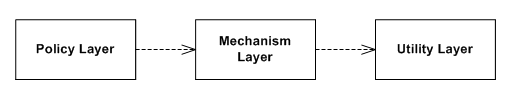
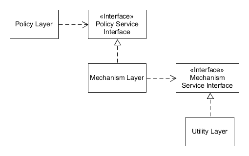

# Dependency Inversion Principle

The Dependency Inversion Principle (DIP) states:

1. High-level modules should not import anything from low-level modules. Both should depend on abstractions (e.g., interfaces).
2. Abstractions should not depend on details. Details (concrete implementations) should depend on abstractions.

In other words, if this is the traditional layers pattern



the DIP states it should be



## Why is this important?

DIP is fundamental to keep a system maintainable because (and not only):

1. it allows unit testing, enabling the mocking of the dependencies
2. a class will always be decoupled from its dependencies implementation: when the behaviour of a dependency implementation needs to be changed, the dependant class will not be impacted
3. allow polymorphism on the dependencies

## An example

Let's suppose we have the `BankAccountStorage` class, which writes the `BankAccount` data inside a storage (e.g. the DB):

```csharp
class BankAccount {
    private BankAccountStorage _storage = new BankAccountStorage();
    public void InTransfer(decimal amount) {
        // ... code ...
        _storage.IncrementAvailability(amount);
        // ... code ...
    }
    public void OutTransfer(decimal amount) {
        // ... code ...
        _storage.CheckAvailability(amount);
        _storage.DecrementAvailability(amount);
        // ... code ...
    }
}

class BankAccountStorage {
    public void CheckAvailability(decimal amount) {
        // check availability or throws
    }
    public void IncrementAvailability(decimal amount) {
        // increment availability on the DB
    }
    public void DecrementAvailability(decimal amount) {
        // decrement availability on the DB
    }
}
```

The initial application is a monolith, with only one DB and a single server.

We are working on the refactor of such application to fulfill Domain Driven Design and produce a microservice with a CQRS (Command Query Responsibility Segregation) pattern.

We are going to introduce:

- the `BankAccountReader` class
- the `BankAccountWriter` class
- a `BankAccountSync` service (not relevant for the example scope)
- as the DIP has not been respected, we now have to create such classes and to **modify the `BankAccount` class**, also if its logic is not changed.

```csharp
class BankAccount {
    private BankAccountReader _storageReader = new BankAccountReader();
    private BankAccountWriter _storageWriter = new BankAccountWriter();
    public void InTransfer(decimal amount) {
        // ... code ...
        _storageWriter.IncrementAvailability(amount);
        // ... code ...
    }
    public void OutTransfer(decimal amount) {
        // ... code ...
        _storageReader.CheckAvailability(amount);
        _storageWriter.DecrementAvailability(amount);
        // ... code ...
    }
}

class BankAccountReader {
    public void CheckAvailability(decimal amount) {
        // check availability or throws
    }
}
class BankAccountWriter {
    public void IncrementAvailability(decimal amount) {
        // increment availability on the DB
    }
    public void DecrementAvailability(decimal amount) {
        // decrement availability on the DB
    }
}
```

This is incrementing the possible break changes we are introducing: we need to modify a class that it has not been modified at all, wasting time.

Applying this to all the (probably many) classes that are using the `BankAccountStorage` class: the result in a huge change that cannot be done gradually, it will take many time and introduce too many possible regression.

### Applying DIP

Let's now implement the Dependency Inversion Principle, for example through a Dependency Injection framework, at the initial situation.

```csharp
class BankAccount {
    private IBankAccountStorage _storage;
    public BankAccount(IBankAccountStorage storage) {
        _storage = storage;
    }

    public void InTransfer(decimal amount) {
        // ... code ...
        _storage.IncrementAvailability(amount);
        // ... code ...
    }
    public void OutTransfer(decimal amount) {
        // ... code ...
        _storage.DecrementAvailability(amount);
        // ... code ...
    }
}

class BankAccountStorage : IBankAccountStorage {
    public void CheckAvailability(decimal amount) {
        // check availability or throws
    }
    public void IncrementAvailability(decimal amount) {
        // increment availability on the DB
    }
    public void DecrementAvailability(decimal amount) {
        // decrement availability on the DB
    }
}

interface IBankAccountStorage {
}
```

The requested change (CQRS pattern implementation), will now produce:

- the new classes
- a *facade class*, that only delegates the methods to the proper instance
- the changes to te injected implementation for the `IBankAccountStorage` interface
- **no edits required to the services using the `IBankAccountStorage`**

```csharp
class BankAccountFacade : IBankAccountStorage {
    private IBankAccountReader _storageReader;
    private IBankAccountWriter _storageWriter;
    public BankAccountFacade(IBankAccountReader reader, IBankAccountWriter writer) {
        _storageReader = reader;
        _storageWriter = writer;
    }
    public void CheckAvailability(decimal amount) => _storageReader.CheckAvailability(amount);
    public void IncrementAvailability(decimal amount) => _storageWriter.IncrementAvailability(amount);
    public void DecrementAvailability(decimal amount) => _storageWriter.DecrementAvailability(amount);
}

interface IBankAccountStorage : IBankAccountReader, IBankAccountWriter {
}

interface IBankAccountReader {
    void CheckAvailability(decimal amount);
}

interface IBankAccountWriter {
    void IncrementAvailability(decimal amount);
    void DecrementAvailability(decimal amount);
}

class BankAccountReader : IBankAccountReader {
    public void CheckAvailability(decimal amount) {
        // check availability or throws
    }
}
class BankAccountWriter : IBankAccountWriter {
    public void IncrementAvailability(decimal amount) {
        // increment availability on the DB
    }
    public void DecrementAvailability(decimal amount) {
        // decrement availability on the DB
    }
}
```

And **this is way much safe, easier, flexible and faster**.
